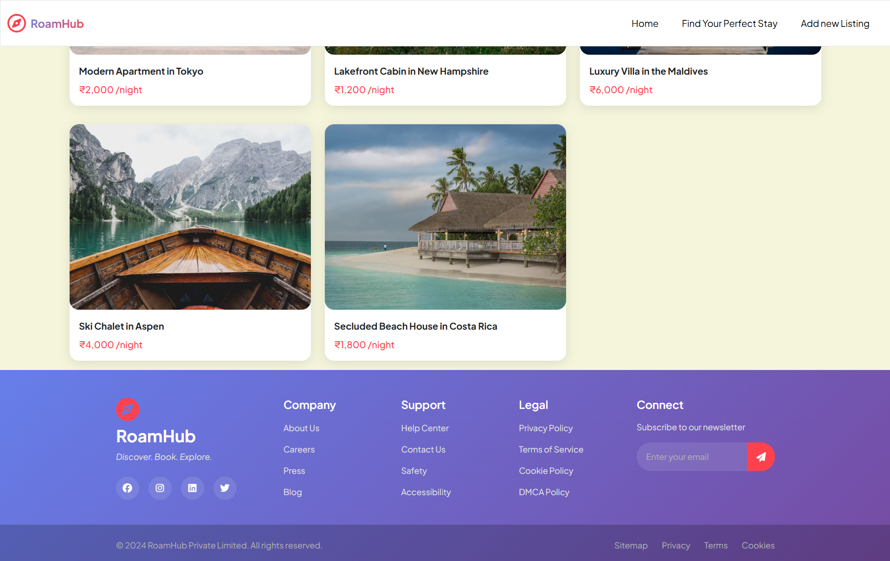
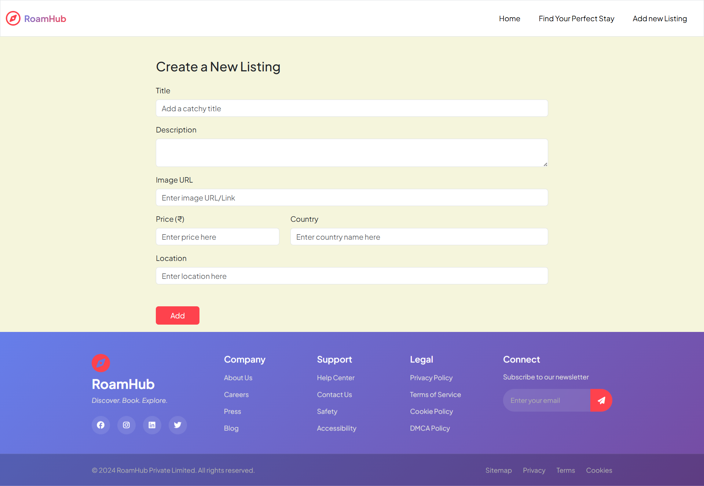

# 🌍 RoamHub 

**RoamHub** is a modern, full-stack listing platform that empowers users to discover, create, and manage location-based listings with ease. Built with **Node.js**, **Express**, and **MongoDB**, featuring a responsive design powered by **Bootstrap 5** and server-side rendering using **EJS**.

---

## 🚀 Features

- 🧾 **Full CRUD Operations** - Create, read, update, and delete listings with ease
- 🌐 **Cloud Database** - MongoDB Atlas integration with Mongoose ODM for scalable data management
- ✨ **Server-Side Rendering** - Fast, SEO-friendly pages with EJS templating and layouts
- 🎨 **Responsive Design** - Mobile-first approach using Bootstrap 5 for all screen sizes
- 🛡️ **Data Validation** - Robust server-side validation with Joi schemas
- 🔐 **Environment Security** - Secure configuration management with environment variables
- 🛠️ **RESTful API** - Clean API design with proper HTTP methods support
- 📱 **Cross-Platform** - Works seamlessly across all devices and browsers

---

## 🏗️ Tech Stack

### Frontend
- **HTML5** - Semantic markup
- **CSS3** - Modern styling
- **Bootstrap 5** - Responsive framework
- **EJS** - Template engine

### Backend
- **Node.js** - JavaScript runtime
- **Express.js** - Web application framework
- **MongoDB** - NoSQL database
- **Mongoose** - MongoDB object modeling

### Tools & Utilities
- **dotenv** - Environment variable management
- **method-override** - HTTP method support
- **Joi** - Schema validation
- **ejs-mate** - EJS layout support

---

## 📦 Quick Start

### Prerequisites
- Node.js (v14 or higher)
- MongoDB Atlas account or local MongoDB installation
- Git

### Installation

1. **Clone the repository**
   ```bash
   git clone https://github.com/your-username/roamhub.git
   cd roamhub
   ```

2. **Install dependencies**
   ```bash
   npm install
   ```

3. **Environment setup**
   Create a `.env` file in the root directory:
   ```env
   ADMIN_MODE=false
   MONGODB_URI=your_mongodb_connection_string
   ```
   
   **Note:** Set `ADMIN_MODE=true` to enable deletion permissions.

4. **Initialize database (optional)**
   ```bash
   node init/index.js
   ```

5. **Start the application**
   ```bash
   npm start
   # or
   node app.js
   ```

6. **Open your browser**
   ```
   http://localhost:8080
   ```

---

## 🌐 Live Demo

🔗 **[Visit RoamHub Live](https://roamhub-nxd1.onrender.com/)**

Experience the full functionality of RoamHub in action!

---
## 📸 Screenshots

<div align="center">

### 🏠 **Homepage - Navigation & Hero Section**

*Clean navigation bar with hero section and featured listings*

### 📋 **Homepage - Footer Section**

*Complete footer with links and contact information*

### ✍️ **Create New Listing - Form Interface**

*User-friendly form for creating new listings with validation*


</div>

---

## 🔧 Upcoming Advancements

### **Enhanced Features in Development**
- 🔍 **Advanced Search & Filtering** - Location-based discovery with multiple criteria
- 🗺️ **Interactive Maps** - Google Maps integration for listing locations
- 📊 **User Dashboard** - Analytics and listing management interface
- 📧 **Email Notifications** - Automated alerts for reviews and bookings
- 🌙 **Dark Mode** - Theme switching for better user experience

### **Security & Performance**
- 🔐 **Multi-factor Authentication** - Enhanced security with 2FA
- 🛡️ **Advanced Authorization** - Granular permission system
- 🚀 **Performance Optimization** - Caching and database indexing
- 📱 **Mobile App** - React Native companion application
- 🔄 **Real-time Updates** - WebSocket integration for live features

---
---

## 🗂️ Project Structure

```
roamhub/
├── 📄 app.js                 # Main application entry point
├── 📄 schema.js              # Joi validation schemas
├── 📁 models/
│   └── 📄 listing.js         # Mongoose listing model
├── 📁 init/
│   ├── 📄 data.js            # Sample seed data
│   └── 📄 index.js           # Database initialization
├── 📁 views/
│   ├── 📄 layout.ejs         # Main layout template
│   ├── 📁 listings/          # Listing-related views
│   └── 📁 includes/          # Reusable components
├── 📁 public/
│   ├── 📁 css/               # Custom stylesheets
│   ├── 📁 js/                # Client-side JavaScript
│   └── 📁 images/            # Static assets
├── 📄 .env                   # Environment variables
├── 📄 package.json           # Dependencies and scripts
└── 📄 README.md              # Project documentation
```

---

## 🛠️ API Endpoints

| Method | Endpoint | Description |
|--------|----------|-------------|
| GET | `/` | Homepage with all listings |
| GET | `/listings` | View all listings |
| GET | `/listings/new` | Create new listing form |
| POST | `/listings` | Create new listing |
| GET | `/listings/:id` | View specific listing |
| GET | `/listings/:id/edit` | Edit listing form |
| PUT | `/listings/:id` | Update listing |
| DELETE | `/listings/:id` | Delete listing |

---

## 🧪 Development

### Running in Development Mode
```bash
# Install nodemon for auto-restart
npm install -g nodemon

# Start with nodemon
nodemon app.js
```

### Database Seeding
```bash
# Populate database with sample data
node init/index.js
```

---


## 🤝 Contributing

We welcome contributions! Here's how you can help:

1. **Fork the repository**
2. **Create a feature branch** (`git checkout -b feature/amazing-feature`)
3. **Commit your changes** (`git commit -m 'Add some amazing feature'`)
4. **Push to the branch** (`git push origin feature/amazing-feature`)
5. **Open a Pull Request**

---

## 🧑‍💻 Author

**Tanish Kumar Sahu**

[](https://linkedin.com/in/tanishkumarsahu)
[](https://github.com/tanishkumarsahu)

---

## 🙌 Acknowledgments

- Thanks to all contributors who help improve RoamHub
- Bootstrap team for the amazing CSS framework
- MongoDB team for the powerful database solution
- Express.js community for the robust web framework

---

## 📞 Support

If you encounter any issues or have questions:
- 🐛 [Report bugs](https://github.com/tanishkumarsahu/roamhub/issues)
- 💡 [Request features](https://github.com/tanishkumarsahu/roamhub/issues)
- ⭐ Star this repository if you find it helpful!

---

<div align="center">
  <p>Made with ❤️ by Tanish Kumar Sahu</p>
  <p>⭐ Star this repository if you found it helpful!</p>
</div>
